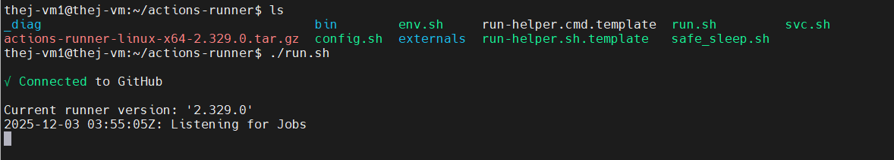
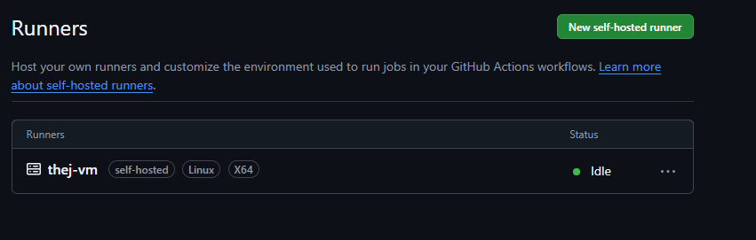
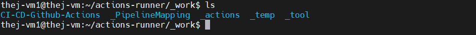
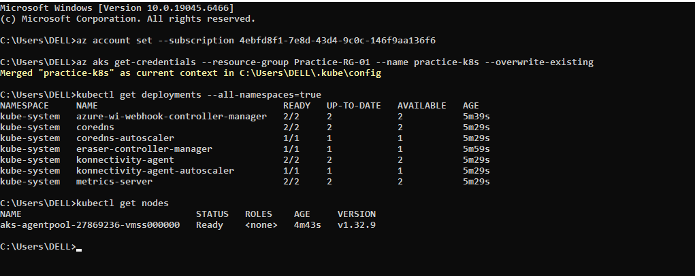
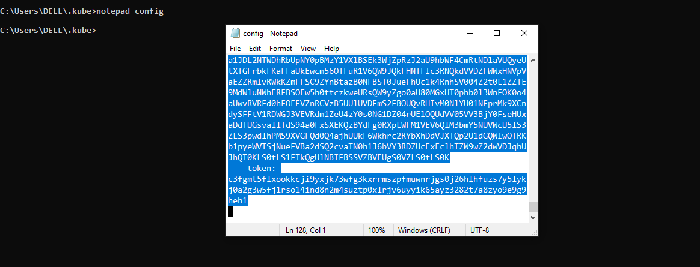
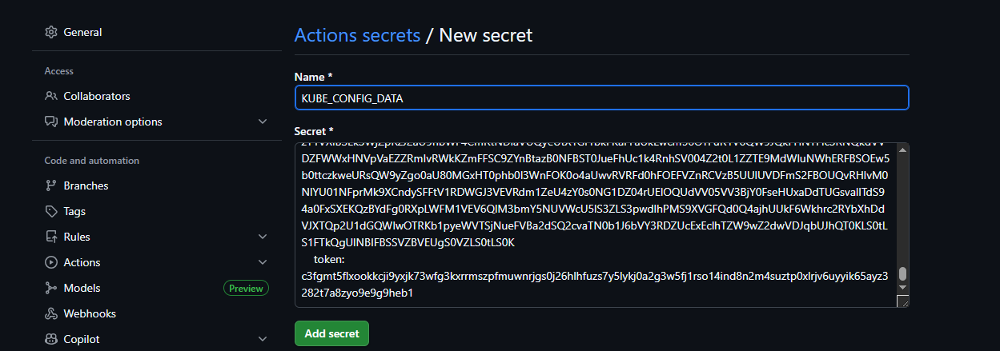

# GitHub Actions (CICD Pipeline tool directly into GitHub)
### Run test Automatically -> Building Source Code -> GHCR (Hub for Docker Images)


# Let's Start GithubAction Concepts

1. Create a Repository in GitHub called CICDPipeline-GithubAction
2. Create a Folder Called GithubAction (you can create with any name) and open it in VSCode
3. Install Nodejs and check the version using node -v and npm -v command
4. In VSCode Add the extension GitHub Action from GitHub, GitHub Co-pilot
5. Initialize the git local Repo and push the code to remote repo
6. Create test.html file and commit it locally and then push to the remote repo  

# Reference for Github actions [Click](https://docs.github.com/en/actions/reference/workflows-and-actions) 

# 1. Create a directory called .github/workflows/ci.yaml

# 2. GitHub can create the CI/CD pipeline on 2 platform Cloud(GitHub) Hosted Runners (ubuntu,windows,macos) Extensible through MarketPlace

# 3. Create first CICD pipeline using GitHub Action, update code in ci.yaml file
```yml
name: CI pipeline
on: push
jobs:
  build:
    runs-on: ubuntu-latest
    steps:
      - name: Printing a message
        run: echo "Hello, World!"
      - name: Show Current time
        run: date
      - name: List files
        run: ls -la
      - name: Print Workflow event
        run: echo "${{ github.event_name }}"
      - name: Show Github workspace
        run: echo "${{ github.workspace }}"
      - name: Show Runner OS
        run: echo "${{ runner.os }}"
```

# 4. Created one more hello.yaml file under workflows folder
```yml
name: Hello World Workflow
on:
  push:
    branches:
      - main
jobs:
  hello_world:
    runs-on: ubuntu-latest
    steps:
      - name: Print Hello World
        run: echo "Hello, World!"
```

---

# 5. Lets add Nodejs code in our repository so that we can do certain operation using GitHub Actions
- npm init -y
- npm install --save-dev jest
- npm install express

**open `package.json` and update the scripts**
```json
"scripts": {
  "start": "node index.js",
  "test": "jest"
},
```

# 6. Create index.js file with following content
```js
function sum(a, b) {
    return a + b;
}
console.log("sub(3,5)=", sum(3, 5));
module.exports = sum;
```

# 7. Create the test directory
- **create file `tests/app.test.js` file**
```js
test("Sample test", () => {
  expect(3 + 5).toBe(8);
});
```

# 8. Create .gitignore file and write below content
- **node_modules/**

# 9. Check the project is ready on dev side
- **node index.js**
- **npm test**


# 10. Create the Node.yaml file under workflows folder
```yml
name: Node.js CI
on: [push, pull_request]
jobs:
  build:
    runs-on: ubuntu-latest
    steps:
      - uses: actions/checkout@v4

      - name: Setup Node.js
        uses: actions/setup-node@v4
        with:
          node-version: '20'
          
      - name: Print Node.js version
        run: node -v
        
      - name: Print npm version
        run: npm -v
        
      - name: Install dependencies
        run: npm install
        
      - name: Run tests
        run: npm test
```

# 11. We can also create the parallel jobs
- **job1 is running in parallel to another job**
- **we are using keyword `needs` which allows jobs to run in aequence way** 

```yml
name: Parallel Jobs
on: [push]
jobs:
  job1:
    runs-on: ubuntu-latest
    steps:
      - name: Job 1 - Print Message
        run: echo "This is Job 1"
        
  job2:
    needs: job1
    runs-on: ubuntu-latest
    steps:
      - name: Job 2 - Print Message
        run: echo "This is Job 2"
        
  job3:
    needs: job2
    runs-on: ubuntu-latest
    steps:
      - name: Job 3 - Print Message
        run: echo "This is Job 3"
```

# 12. complete-ci.yml
```yml
name: CI Pipeline

on:
  pull_request:

jobs:
  lint:
    runs-on: ubuntu-latest
    steps:
      - uses: actions/checkout@v4
      
      - uses: actions/setup-node@v4
        with:
          node-version: 20

      - name: Install dependencies
        run: npm ci

      - name: Run linter
        run: npm run lint --if-present

  test:
    runs-on: ubuntu-latest
    needs: lint
    strategy:
      matrix:
        node: [18, 20]

    steps:
      - uses: actions/checkout@v4
      
      - uses: actions/setup-node@v4
        with:
          node-version: ${{ matrix.node }}

      - name: Cache dependencies
        uses: actions/cache@v4
        with:
          path: ~/.npm
          key: ${{ runner.os }}-npm-${{ hashFiles('package-lock.json') }}

      - name: Install dependencies
        run: npm ci

      - name: Run unit tests
        run: npm test --if-present

      - name: Upload test coverage
        uses: actions/upload-artifact@v4
        with:
          name: coverage-${{ matrix.node }}
          path: coverage/

  build:
    runs-on: ubuntu-latest
    needs: test

    steps:
      - uses: actions/checkout@v4

      - uses: actions/setup-node@v4
        with:
          node-version: 20

      - name: Install dependencies
        run: npm ci

      - name: Build project
        run: npm run build --if-present

      - name: Upload build artifacts
        uses: actions/upload-artifact@v4
        with:
          name: build-output
          path: dist/

  integration-tests:
    runs-on: ubuntu-latest
    needs: build

    steps:
      - uses: actions/checkout@v4

      - uses: actions/setup-node@v4
        with:
            node-version: 20

      - name: Upload integration test logs
        uses: actions/upload-artifact@v4
        with:
          name: integration-logs
          path: logs/

  report:
    runs-on: ubuntu-latest
    needs: [build, test, integration-tests]

    steps:
      - name: Final summary
        run: echo "CI pipeline completed successfully."
```

# 13. dockerfile
```
# Stage 1: Builder
FROM node:20-alpine AS builder
WORKDIR /app
RUN mkdir -p /app/dist

COPY index.js /app/dist/index.js
COPY package*.json ./
RUN npm ci

COPY . .
RUN npm run build --if-present

# Stage 2: Production image
FROM node:20-alpine AS prod
WORKDIR /app

COPY --from=builder /app/dist ./dist
COPY package*.json ./

RUN npm ci --only=production

CMD ["node", "dist/index.js"]

```

# 14 docker-ci.yml file 

```yml
name: Docker Build (CI)

on:
  push:
    branches: [ main ]
  pull_request:

jobs:
  build:
    runs-on: ubuntu-latest

    steps:
      - uses: actions/checkout@v4

      - name: Set up QEMU
        uses: docker/setup-qemu-action@v3

      - name: Set up Docker Buildx
        uses: docker/setup-buildx-action@v3

      - name: Build Docker image
        uses: docker/build-push-action@v5
        with:
          context: .
          file: ./Dockerfile
          platforms: linux/amd64
          push: false
          tags: myapp:ci
```


13. Build and push the image to dockerhub using GitHub Actions 

```bash
- Generate token in Github with read,write,delete permissions 

- Need to give secrets
   - GitHub->settings->secrets and variables->actions->click on new repository 
    DOCKERHUB_USERNAME: xxxxx
    DOCKERHUB_TOKEN: xxxxxx

```

```yml
name: Docker Build (CI)
on:
  # push:
  #   branches: [ main ]
  pull_request:

jobs:
  build:
    runs-on: ubuntu-latest

    steps:
      - uses: actions/checkout@v4
      - name: Login to Docker Hub
        uses: docker/login-action@v3
        with:
          username: ${{ secrets.DOCKERHUB_USERNAME }}
          password: ${{ secrets.DOCKERHUB_TOKEN }}
      - name: Build docker image
        run: |
          docker build -t ${{ secrets.DOCKERHUB_USERNAME }}/myapp:ci .
      - name: Push docker image
        run: |
          docker push ${{ secrets.DOCKERHUB_USERNAME }}/myapp:ci
```

14. build and push the image to acr using github actions 

```bash
- search Create container registry
- create ACR in Azure, copy(username,login-server,password) 

- Need to give secrets
   - GitHub->settings->secrets and variables->actions->click on new repository 
    ACR_USERNAME: xxxxxx
    ACR_LOGIN_SERVER: xxxxx
    ACR_PASSWORD: xxxxxx

```


```yml
name: Docker Build (CI)
on:
  push:
    branches: [ main ]
  pull_request:

jobs:
  build:
    runs-on: ubuntu-latest

    steps:
      - uses: actions/checkout@v4
     
      - name: Login to Azure Container Registry
        uses: docker/login-action@v3
        with:
          registry: ${{ secrets.ACR_LOGIN_SERVER }}
          username: ${{ secrets.ACR_USERNAME }}
          password: ${{ secrets.ACR_PASSWORD }}
      - name: Build docker image
        run: |
          docker build -t ${{ secrets.ACR_LOGIN_SERVER }}/myapp:ci .
      - name: Push docker image
        run: |
          docker push ${{ secrets.ACR_LOGIN_SERVER }}/myapp:ci 

```


===

15. Push the image to GHCR and give read and write permissions for workflow to use to the user
 - create token with required permissions to push image to GHCR 
 - copy token and paste into secrets 

```yml
name: Docker Build (CI)
on:
  push:
    branches: [ main ]
  pull_request:

jobs:
  build:
    runs-on: ubuntu-latest

    steps:
      - name: Checkout repository
        uses: actions/checkout@v4
      - name: Login to GHCR
        uses: docker/login-action@v3
        with:
          registry: ghcr.io
          username: ${{ github.actor }}
          password: ${{ secrets.GH_TOKEN }}
      - name: Build docker image
        run: |
          docker build -t ghcr.io/${{ github.repository_owner }}/myapp:ci .
      - name: Push docker image
        run: |
          docker push ghcr.io/${{ github.repository_owner }}/myapp:ci

```


16. Setting Up SelfHosted Runner in GitHub  
  
  ```
  -> Goto CI-CD-Github-Actions repo
	-> Actions
	  -> Runners
	  -> click on New self Hosted Runner 
  ```


- Install and Configure 






- Run Below Yaml file for testing 

```bash
name: Hello World Workflow
on:
    push:
        branches:
            - main
jobs:
    hello_world:
     runs-on: self-hosted
     steps:
        - name: Print Hello World
          run: echo "Hello, World!"
        - uses: actions/checkout@v4  
```


- After Ruuning Code will be downloaded into Our Machine      




17. Integrating with  Kubernetes 

  
  
  - To Integrate Github Actions self-Hosted machine with Kuberenetes cluster it needs to authenticated with config file  
  - Copy ~./kube/config file 
  - pste into Github secrets location 
      KUBE_CONFIG_DATA: xxxxxx

 

 


===

# Nodejs Code Initialize Process from starting 
## 1. Nodejs project structure
```bash
project/
│── index.js
│── package.json
│── tests/
│     └── app.test.js
```

Here is the **complete step-by-step flow from scratch** — exactly how you will do it on your system.

---

# ✅ **1. Create a new Node.js project**

```sh
npm init -y
```

This creates a default `package.json`.

---

# ✅ **2. Install Express**

```sh
npm install express
```

---

# ✅ **3. Install Jest (dev dependency)**

```sh
npm install --save-dev jest
```

---

# ✅ **4. Update package.json test script**

Open `package.json` → replace test script:

**Before**

```json
"test": "echo \"Error: no test specified\" && exit 1"
```

**After**

```json
"test": "jest"
```

---

# ✅ **5. Create index.js**

`index.js`

```js
function sum(a, b) {
  return a + b;
}

console.log("sum(3,5) =", sum(3, 5));

module.exports = sum;
```

---

# ✅ **6. Create test folder and test file**

```sh
mkdir tests
```

Create `tests/app.test.js`

```js
const sum = require("../index");

test("adds two numbers", () => {
  expect(sum(3, 5)).toBe(8);
});
```

---

# ✅ **7. Run Tests**

```sh
npm test
```

Expected output:

```
PASS  tests/app.test.js
✓ adds two numbers (5 ms)
```

---

# 🎯 Summary

| Step            | Command                       |
| --------------- | ----------------------------- |
| Init project    | `npm init -y`                 |
| Install express | `npm install express`         |
| Install jest    | `npm install --save-dev jest` |
| Run tests       | `npm test`                    |

---
