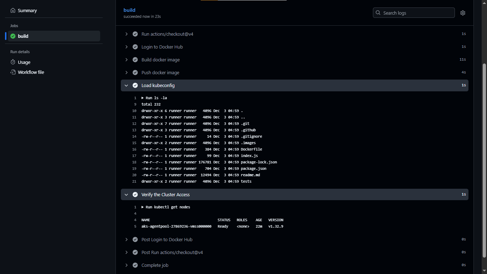

## GitHub Actions (CICD Pipeline tool directly into GitHub)
### Run test Automatically -> Building Source Code -> GHCR (Hub for Docker Images)


# Let's Start GitHub Actions Concepts

1. **Create a Repository in GitHub** called CICDPipeline-GithubAction
2. **Create a Folder** called GithubAction (you can create with any name) and **open it in VSCode**
3. **Install Node.js** and check the version using `node -v` and `npm -v` command
4. **In VSCode Add extensions**: GitHub Actions from GitHub, GitHub Copilot
5. **Initialize the git local repo** and push the code to remote repo
6. **Create test.html file** and commit it locally then push to the remote repo


## 📚 Resources & Next Steps

- **GitHub Actions Documentation**: [Official Reference](https://docs.github.com/en/actions/reference/workflows-and-actions)

### Create Workflow Directory

Create a new directory structure for GitHub Actions:

```bash
mkdir -p .github/workflows
```

Then create your first workflow file:

```bash
touch .github/workflows/ci.yaml
```

This will trigger automatic CI/CD pipelines on code push.


# 2. GitHub Actions CI/CD Platforms

GitHub Actions supports two runner types:

- **GitHub-hosted runners**: Pre-configured environments (Ubuntu, Windows, macOS)
- **Self-hosted runners**: Custom machines with extensible marketplace integrations

---

# 3. Create Your First CI/CD Pipeline

Update the `ci.yaml` file in `.github/workflows/`:

```yml
name: CI pipeline
on: push
jobs:
  build:
    runs-on: ubuntu-latest
    steps:
      - name: Printing a message
        run: echo "Hello, World!"
      - name: Show Current time
        run: date
      - name: List files
        run: ls -la
      - name: Print Workflow event
        run: echo "${{ github.event_name }}"
      - name: Show Github workspace
        run: echo "${{ github.workspace }}"
      - name: Show Runner OS
        run: echo "${{ runner.os }}"
```

# 4. Create Hello World Workflow

Create a new workflow file `hello.yaml` under `.github/workflows/`:

```yml
name: Hello World Workflow
on:
  push:
    branches:
      - main
jobs:
  hello_world:
    runs-on: ubuntu-latest
    steps:
      - name: Print Hello World
        run: echo "Hello, World!"
```

This workflow triggers on every push to the `main` branch and executes a simple echo command.

---


# 5. Add Node.js Code to Your Repository

Initialize the Node.js project and install dependencies:

```bash
npm init -y
npm install express
npm install --save-dev jest
```

Update the `scripts` section in `package.json`:

```json
"scripts": {
  "start": "node index.js",
  "test": "jest"
}
```


# 6. Create index.js

Create `index.js` with the following content:

```js
function sum(a, b) {
  return a + b;
}

console.log("sum(3,5) =", sum(3, 5));

module.exports = sum;
```

---

# 7. Create test directory and test file

Create `tests/app.test.js`:

```js
const sum = require("../index");

test("adds two numbers", () => {
  expect(sum(3, 5)).toBe(8);
});
```

---

# 8. Create .gitignore file

Add the following to `.gitignore`:

```
node_modules/
```

---

# 9. Test your project locally

Run the following commands:

```bash
node index.js
npm test
```

Expected output:

```
sum(3,5) = 8
PASS  tests/app.test.js
✓ adds two numbers
```

---


# 10. Create Node.js Workflow

Create `.github/workflows/node.yaml`:

```yml
name: Node.js CI
on: [push, pull_request]
jobs:
  build:
    runs-on: ubuntu-latest
    steps:
      - uses: actions/checkout@v4
      - uses: actions/setup-node@v4
        with:
          node-version: '20'
      - name: Install dependencies
        run: npm install
      - name: Run tests
        run: npm test
```

---

# 11. Parallel and Sequential Jobs

Use the `needs` keyword to control job execution order:

```yml
name: Parallel Jobs
on: [push]
jobs:
  job1:
    runs-on: ubuntu-latest
    steps:
      - run: echo "Job 1"
        
  job2:
    needs: job1
    runs-on: ubuntu-latest
    steps:
      - run: echo "Job 2"
        
  job3:
    needs: job2
    runs-on: ubuntu-latest
    steps:
      - run: echo "Job 3"
```

---

# 12. Complete CI Pipeline

```yml
name: CI Pipeline
on: [push, pull_request]
jobs:
  lint:
    runs-on: ubuntu-latest
    steps:
      - uses: actions/checkout@v4
      - uses: actions/setup-node@v4
        with:
          node-version: 20
      - run: npm ci
      - run: npm run lint --if-present

  test:
    needs: lint
    runs-on: ubuntu-latest
    strategy:
      matrix:
        node: [18, 20]
    steps:
      - uses: actions/checkout@v4
      - uses: actions/setup-node@v4
        with:
          node-version: ${{ matrix.node }}
      - uses: actions/cache@v4
        with:
          path: ~/.npm
          key: ${{ runner.os }}-npm-${{ hashFiles('package-lock.json') }}
      - run: npm ci
      - run: npm test --if-present

  build:
    needs: test
    runs-on: ubuntu-latest
    steps:
      - uses: actions/checkout@v4
      - uses: actions/setup-node@v4
        with:
          node-version: 20
      - run: npm ci
      - run: npm run build --if-present
      - uses: actions/upload-artifact@v4
        with:
          name: build-output
          path: dist/
```

---

# 13. Dockerfile

```dockerfile
FROM node:20-alpine AS builder
WORKDIR /app
COPY package*.json ./
RUN npm ci
COPY . .
RUN npm run build --if-present

FROM node:20-alpine
WORKDIR /app
COPY --from=builder /app/dist ./dist
COPY package*.json ./
RUN npm ci --only=production
CMD ["node", "dist/index.js"]
```

```
# Stage 1: Builder
FROM node:20-alpine AS builder
WORKDIR /app
RUN mkdir -p /app/dist

COPY index.js /app/dist/index.js
COPY package*.json ./
RUN npm ci

COPY . .
RUN npm run build --if-present

# Stage 2: Production image
FROM node:20-alpine AS prod
WORKDIR /app

COPY --from=builder /app/dist ./dist
COPY package*.json ./

RUN npm ci --only=production

CMD ["node", "dist/index.js"]

```

# 14 docker-ci.yml file 

```yml
name: Docker Build (CI)

on:
  push:
    branches: [ main ]
  pull_request:

jobs:
  build:
    runs-on: ubuntu-latest

    steps:
      - uses: actions/checkout@v4

      - name: Set up QEMU
        uses: docker/setup-qemu-action@v3

      - name: Set up Docker Buildx
        uses: docker/setup-buildx-action@v3

      - name: Build Docker image
        uses: docker/build-push-action@v5
        with:
          context: .
          file: ./Dockerfile
          platforms: linux/amd64
          push: false
          tags: myapp:ci
```


13. Build and push the image to dockerhub using GitHub Actions 

```bash
- Generate token in Github with read,write,delete permissions 

- Need to give secrets
   - GitHub->settings->secrets and variables->actions->click on new repository 
    DOCKERHUB_USERNAME: xxxxx
    DOCKERHUB_TOKEN: xxxxxx

```

```yml
name: Docker Build (CI)
on:
  # push:
  #   branches: [ main ]
  pull_request:

jobs:
  build:
    runs-on: ubuntu-latest

    steps:
      - uses: actions/checkout@v4
      - name: Login to Docker Hub
        uses: docker/login-action@v3
        with:
          username: ${{ secrets.DOCKERHUB_USERNAME }}
          password: ${{ secrets.DOCKERHUB_TOKEN }}
      - name: Build docker image
        run: |
          docker build -t ${{ secrets.DOCKERHUB_USERNAME }}/myapp:ci .
      - name: Push docker image
        run: |
          docker push ${{ secrets.DOCKERHUB_USERNAME }}/myapp:ci
```

14. Build and Push the Image to Azure Container Registry (ACR) Using GitHub Actions

To set up your Azure Container Registry (ACR) and integrate it with GitHub Actions, follow these steps:

1. **Create an Azure Container Registry**:
  - In the Azure portal, search for "Container Registries" and create a new registry.
  - Make sure to copy the following details:
    - **Username**
    - **Login Server**
    - **Password**

2. **Configure GitHub Secrets**:
  - Navigate to your GitHub repository.
  - Go to **Settings** > **Secrets and variables** > **Actions**.
  - Click on **New repository secret** and add the following secrets:
    - `ACR_USERNAME`: Your ACR username
    - `ACR_LOGIN_SERVER`: Your ACR login server URL
    - `ACR_PASSWORD`: Your ACR password

3. **GitHub Actions Workflow**:
  - Create or update your GitHub Actions workflow file (e.g., `.github/workflows/docker-build.yml`) with the following content:

- This workflow will build your Docker image and push it to your Azure Container Registry whenever there is a push to the `main` branch or a pull request is created.

- Make sure to replace `myapp` with your desired image name.
- Ensure that your Dockerfile is correctly set up in the root of your repository.

- This setup will automate the process of building and pushing your Docker images to ACR using GitHub Actions.


```yml
name: Docker Build (CI)
on:
  push:
    branches: [ main ]
  pull_request:

jobs:
  build:
    runs-on: ubuntu-latest

    steps:
      - uses: actions/checkout@v4
     
      - name: Login to Azure Container Registry
        uses: docker/login-action@v3
        with:
          registry: ${{ secrets.ACR_LOGIN_SERVER }}
          username: ${{ secrets.ACR_USERNAME }}
          password: ${{ secrets.ACR_PASSWORD }}
      - name: Build docker image
        run: |
          docker build -t ${{ secrets.ACR_LOGIN_SERVER }}/myapp:ci .
      - name: Push docker image
        run: |
          docker push ${{ secrets.ACR_LOGIN_SERVER }}/myapp:ci 

```


===

15. Push the image to GHCR and configure permissions for the workflow:

- **Create a Personal Access Token**: Generate a token with the necessary permissions to push images to GHCR. Ensure it has `write:packages` and `read:packages` scopes.

- **Add the Token to GitHub Secrets**: Navigate to your repository settings, go to **Secrets and variables** > **Actions**, and create a new secret. Name it `GH_TOKEN` and paste the generated token.

- **Update Your Workflow**: Ensure your GitHub Actions workflow is set up to use this token for authentication when pushing images to GHCR.

- **Example Workflow Snippet**:
```yml
- name: Login to GHCR
  uses: docker/login-action@v3
  with:
    registry: ghcr.io
    username: ${{ github.actor }}
    password: ${{ secrets.GH_TOKEN }}
```
- This setup allows your workflow to authenticate and push images to GitHub Container Registry seamlessly.

```yml
name: Docker Build (CI)
on:
  push:
    branches: [ main ]
  pull_request:

jobs:
  build:
    runs-on: ubuntu-latest

    steps:
      - name: Checkout repository
        uses: actions/checkout@v4
      - name: Login to GHCR
        uses: docker/login-action@v3
        with:
          registry: ghcr.io
          username: ${{ github.actor }}
          password: ${{ secrets.GH_TOKEN }}
      - name: Build docker image
        run: |
          docker build -t ghcr.io/${{ github.repository_owner }}/myapp:ci .
      - name: Push docker image
        run: |
          docker push ghcr.io/${{ github.repository_owner }}/myapp:ci

```


# 16. Setting Up Self-Hosted Runner in GitHub

Follow these steps to configure a self-hosted runner:

1. **Navigate to your repository settings**:
  - Go to your GitHub repository
  - Click on **Actions** tab
  - Select **Runners** from the left sidebar

2. **Create a new self-hosted runner**:
  - Click on **New self-hosted runner**
  - Select your operating system (Linux, Windows, or macOS)
  - Follow the provided setup instructions

3. **Key Points**:
  - Download and configure the runner on your machine
  - The runner will execute workflows on your local hardware
  - Useful for jobs requiring specific dependencies or hardware access


- Install and Configure 


- Run Below Yaml file for testing 

```bash
name: Hello World Workflow
on:
    push:
        branches:
            - main
jobs:
    hello_world:
     runs-on: self-hosted
     steps:
        - name: Print Hello World
          run: echo "Hello, World!"
        - uses: actions/checkout@v4  
```


- After Ruuning Code will be downloaded into Our Machine      


17. Integrating with  Kubernetes 

  
  
  - To Integrate Github Actions self-Hosted machine with Kuberenetes cluster it needs to authenticated with config file  
  - Copy ~./kube/config file 
  - pste into Github secrets location 
      KUBE_CONFIG_DATA: xxxxxx

 

 

 - After Building 

 


===

# Nodejs Code Initialize Process from starting 
## 1. Nodejs project structure
```bash
project/
│── index.js
│── package.json
│── tests/
│     └── app.test.js
```

Here is the **complete step-by-step flow from scratch** — exactly how you will do it on your system.

---

# ✅ **1. Create a new Node.js project**

```sh
npm init -y
```

This creates a default `package.json`.

---

# ✅ **2. Install Express**

```sh
npm install express
```

---

# ✅ **3. Install Jest (dev dependency)**

```sh
npm install --save-dev jest
```

---

# ✅ **4. Update package.json test script**

Open `package.json` → replace test script:

**Before**

```json
"test": "echo \"Error: no test specified\" && exit 1"
```

**After**

```json
"test": "jest"
```

---

# ✅ **5. Create index.js**

`index.js`

```js
function sum(a, b) {
  return a + b;
}

console.log("sum(3,5) =", sum(3, 5));

module.exports = sum;
```

---

# ✅ **6. Create test folder and test file**

```sh
mkdir tests
```

Create `tests/app.test.js`

```js
const sum = require("../index");

test("adds two numbers", () => {
  expect(sum(3, 5)).toBe(8);
});
```

---

# ✅ **7. Run Tests**

```sh
npm test
```

Expected output:

```
PASS  tests/app.test.js
✓ adds two numbers (5 ms)
```

---

# 🎯 Summary

| Step            | Command                       |
| --------------- | ----------------------------- |
| Init project    | `npm init -y`                 |
| Install express | `npm install express`         |
| Install jest    | `npm install --save-dev jest` |
| Run tests       | `npm test`                    |

---
